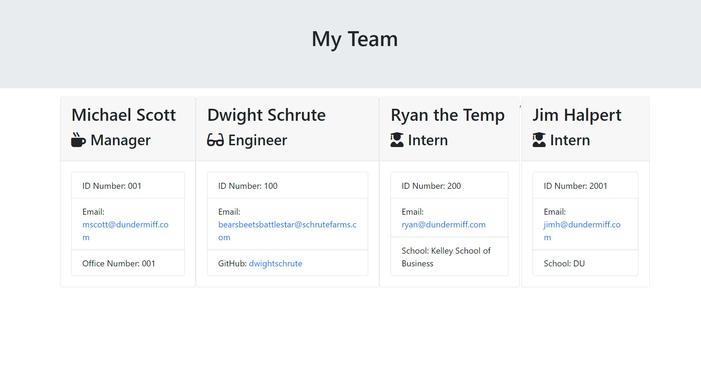

# Team Profile Generator- Homework 09

## Description

This application generates a custom team profile webpage based off user input; entered via command line prompt. This application uses Inquirer to serve questions, Node JS & its modules, and Jest for testing suites.

The created HTML uses modern Bootstrap styling.

## Installation

- To see the porfolio, visit my [Github Repository](https://github.com/patrickbrown-io/team-profile-generator-app)

- To install this app, clone the repository and npm i.

## Usage

To run: 'node index.js'

After completing the prompts served to you, and selecting 'DONE' -- a generated HTML file will be placed in the OUTPUT directory.

## Walkthrough

Video walkthrough of working application: [YouTube](https://youtu.be/H0oxRphdzVU)

## Credits

[Patrick Brown](https://github.com/patrickbrown-io)

## Features

- Easy prompts for team members and information. Enter as many team members as needed, selecting DONE ends employee entry.
- Automatic HTML file generation, output folder allows for easy retrieval
- Automatic Bootstrap styling to generated HTML file
- Clicking links to email or GitHub are automatically mapped and open in new tabs
- A full testing suite

## How to Contribute

Send me a message via GitHub and we can connect!
